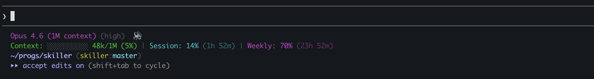

# groundwork-statusline

A 3-line statusline for Claude Code showing model info, context window usage, and git/project context.



## What it displays

- **Line 1**: Model name, effort level, [bells-and-whistles](https://github.com/etr/bells-and-whistles) mute indicator
- **Line 2**: Context window bar chart with token usage, session utilization %, weekly utilization % (from Anthropic API, cached 5 min)
- **Line 3**: Current directory, git repo:branch, PR number, [groundwork](https://github.com/etr/groundwork) project

## Installation

Install via the groundwork marketplace:

```bash
claude plugin marketplace add etr/groundwork-marketplace
claude plugin install groundwork-statusline@groundwork-marketplace
```

Then run the install command inside Claude Code:

```
/groundwork-statusline:install
```

Restart Claude Code to see the statusline.

## Uninstallation

Inside Claude Code:

```
/groundwork-statusline:uninstall
```

Then restart Claude Code.

## Requirements

- `jq` — JSON parsing
- `python3` — credential/plugin path resolution
- `curl` — Anthropic usage API calls
- `gh` (optional) — PR number lookup
- `git` — repo/branch detection
